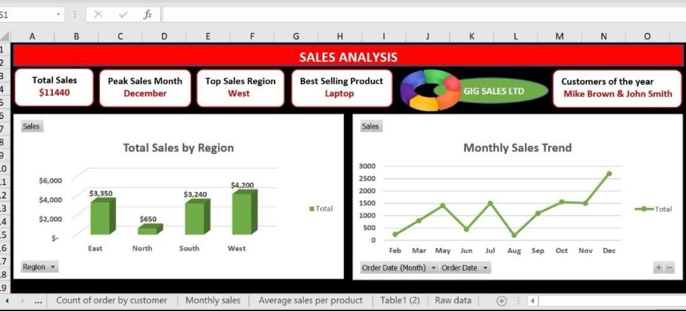

# Messy-Data-Cleanup-Business-Reporting-Excel-Dashboard
Cleaned, transformed, and analyzed a messy sales dataset in Excel to demonstrate a complete data preparation and reporting workflow. The project involved identifying data quality issues, standardizing inconsistent records, performing lookups, creating pivot-based analysis, and building a dashboard to extract business insights.
Data Cleaning & Transformation
Identified duplicate and inconsistent records
Standardized incorrect values and missing information
Cleaned customer and sales fields
Converted date formats for reporting
Created validation checks for data accuracy
- Data Preparation
Used XLOOKUP to match product information
Created calculated fields for analysis
Prepared structured data for reporting
- Excel Dashboard & Analysis
Created reports analyzing:
Sales by region
Product performance
Customer order patterns
Monthly sales trends
- Key Insights:
Identified the highest-performing region
Highlighted top-selling products
Analyzed seasonal sales trends
Provided recommendations based on sales patterns
- Tools:
Microsoft Excel
Data Cleaning
XLOOKUP
Pivot Tables
Conditional Formatting
Data Visualization
Dashboard Creation

